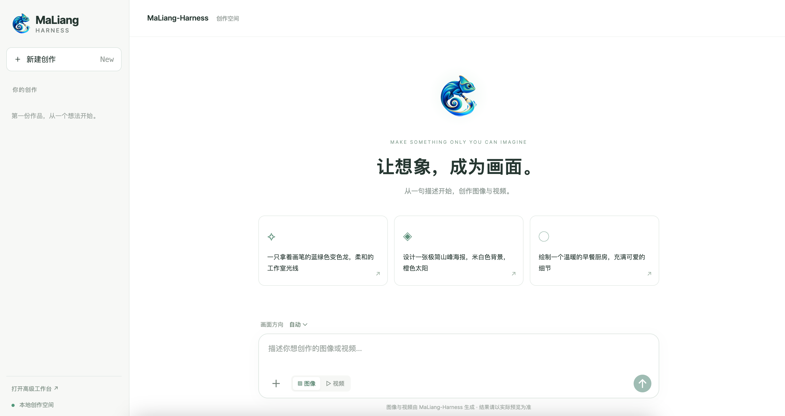
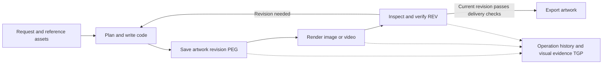

<div align="center">
  <h1>&nbsp;MaLiang-Harness: A Programmable Path to <br> Image and Video Generation</h1>
  <p><strong>English</strong> | <a href="README.zh-CN.md">简体中文</a></p>
  <!-- <p><strong>A Programmable Path to Image and Video Generation</strong></p> -->
  <p>
    <a href="https://gulucaptain.github.io/MaLiang-Harness/"></a>
    <a href="https://arxiv.org/abs/2609.34309"></a>
    <a href="https://huggingface.co/papers/2609.34309" title="Entry pending"></a>
  </p>
  <p><small>The Hugging Face Daily Papers entry is not live yet.</small></p>
  <p>Generate images and videos with programs written by multimodal language models.</p>
  <p>
    <a href="#quick-start">Quick Start</a> ·
    <a href="#chat-interface">Chat Interface</a> ·
    <a href="#evaluation">Evaluation</a> ·
    <a href="docs/USAGE.md">Documentation (Chinese)</a>
  </p>
</div>

MaLiang-Harness uses multimodal language models to write drawing and animation programs that produce images and videos. Models render their code with backends such as Canvas, SVG, and Three.js, inspect the output, and revise the code. Built on Deep Agents, the project includes a CLI, a chat interface, and batch evaluation tools.

We study the gap between code and its visual output: a program may run without errors while placing an object incorrectly or producing the wrong motion. We call this the Program-to-Visual (P2V) Gap in the paper. MaLiang-Harness keeps program revisions and their rendered results so models can refer to earlier work during editing and check the revision they are about to export.



## Core Design

| Design | Implementation |
| --- | --- |
| **PEG — Persistent Executable Generation** | Stores programs, assets, requirements, and plans, with a revision snapshot for each committed change. |
| **TGP — Traceable Generation Process** | Records tool calls and their results, associating operations and rendered output with their revisions. |
| **REV — Revision-aware Editing and Verification** | Supports restoration and new editing runs from historical revisions; checks are renewed after changes. |



An image is a rendering at a specified time; a video samples the motion defined by the program at a given frame rate. Both use the same revision tracking, with the revision number advancing when the program or plan changes.

Before export, the harness checks file format, dimensions, applicable structural constraints, and the current revision's checkpoints and visual reviews. Models perform the visual reviews; independent quality evaluation is a separate step.

## Features

- Generate PNG images and silent MP4 videos, with code controlling composition, text, materials, and motion.
- Upload reference images, edit through chat, or start a new editing run from a historical revision.
- Inspect tool calls, rendering previews, and code changes; resume an interrupted run.
- Set budgets for model calls, tool calls, elapsed time, and tokens.
- Optionally use an image generation service to supply assets. The quick-start configuration disables this feature.
- Evaluate different models with the same tools, or add tools and rendering backends.

| Backend | Use cases | Dependencies or scope |
| --- | --- | --- |
| Canvas / SVG | Programmatic drawing, graphics, and typography | Chromium |
| Scene2D | Objects, layers, keyframes, and 2D animation | Chromium |
| SVG Animation / Three.js | Vector animation, 3D scenes, and motion | Chromium; 3D rendering requires a working graphics backend |
| Paint | Layered brush strokes, pressure, soft edges, smudging, and erasing | Optional native libmypaint library |
| Pathtrace | Still-life scenes, materials, lighting, and path tracing | WebGL; currently exports PNG images |

See the [usage guide](docs/USAGE.md) for capabilities and backend configuration, and the [extension guide](docs/EXTENDING.md) for tool contracts and integration. These detailed guides are currently in Chinese.

## Quick Start

### 1. Install

Python 3.12 is recommended. Clone the repository and run the following from its root:

```bash
git clone https://github.com/gulucaptain/MaLiang-Harness.git
cd MaLiang-Harness

python3.12 -m venv .venv
source .venv/bin/activate
python -m pip install -e '.[dev]'
python -m pip install --no-deps -e vendor/deepagents/libs/deepagents
python -m playwright install chromium
python -m pip check
maliang-harness doctor
```

The project uses a pinned Deep Agents source checkout; see [vendor/UPSTREAM.json](vendor/UPSTREAM.json). The web frontend and browser modules for Three.js and path tracing are prebuilt, so normal use does not require Node.js. See [native brush painting](docs/USAGE.md#原生笔触绘画libmypaint) for Paint's additional dependencies and installation instructions.

Dependency ranges are declared in `pyproject.toml`. The historical Python 3.12 environment snapshot in [requirements/](requirements/README.md) is retained for reference; it is not a verified cross-platform lockfile.

### 2. Run an Offline Example

```bash
python examples/scene_demo.py --project runs/scene-demo
```

This example uses a deterministic scripted model to exercise creation and rendering, **without calling a model API**. Use a new output directory; generated files are saved in the specified subdirectory of `runs/`. The example checks your installation and does not represent a real model's generation quality.

For brush painting, path tracing, and end-to-end examples, see [examples/README.md](examples/README.md).

### 3. Configure a Model

Choose a model with tool-calling support. Visual feedback also requires image input support from both the model and its API. Set credentials and a model ID you have access to:

```bash
export OPENAI_API_KEY='YOUR_API_KEY'
export MALIANG_MODEL='YOUR_MODEL_ID'
# Set OPENAI_BASE_URL separately if using a compatible gateway.
```

The main inference entry point uses the Responses API. Compatible services must support the required tool calls and multimodal interactions. For Chat Completions and model-specific adapters, see the [evaluation guide](benchmarks/README.md). Do not commit real credentials to the repository.

### 4. Generate an Image or Video

```bash
# Image: the quick-start configuration disables additional image generation services.
python inference.py --config examples/harness.quickstart.json \
  --model "$MALIANG_MODEL" \
  --prompt 'Create a geometric mountain poster in navy blue, orange, and ivory'

# Video: the program defines motion and exports a silent MP4.
python inference.py --config examples/harness.quickstart.json \
  --model "$MALIANG_MODEL" --task video --duration 3 --fps 12 \
  --prompt 'An orange sun slowly moves from left to right against an ivory background'
```

Inference calls a real model API and creates an independent run directory under `runs/` by default. Configuration files control the model, budgets, canvas, and optional asset services. Run `python inference.py --help` for available arguments.

## Chat Interface

The web interface reads [harness.json](harness.json) from the repository root. Before starting it, configure `model.name`, budgets, and optional image generation settings. The web interface does not automatically use the quick-start configuration, and setting `MALIANG_MODEL` alone does not override its configured model name.

```bash
python web.py --port 7860
```

Open [http://127.0.0.1:7860](http://127.0.0.1:7860):

- Enter a request, upload a reference image, view image or video results, and continue editing through chat.
- Expand the creation process panel (「创作过程」) to inspect recorded public model output, tool operations, and intermediate previews. It updates by event and does not expose hidden reasoning or a token-by-token reasoning stream.
- Open the advanced workspace at `/studio` from the bottom-left link to inspect historical revisions and code differences, or access brush painting and path tracing.
- Deleting a creation from the sidebar requires confirmation and permanently removes that run's local files. Independent subsequent editing runs are retained.

See [frontend/README.md](frontend/README.md) for frontend source, build instructions, and upstream attribution.

### Edit and Resume

Select a creation in the web interface and enter a follow-up instruction. The CLI also supports creating a new editing run from a specific revision:

```bash
# Replace the path and revision number with an existing run and revision.
python inference.py --edit-from runs/YOUR_RUN --revision 3 \
  --project runs/my-edit --model "$MALIANG_MODEL" \
  --prompt 'Keep the composition and change the background to navy blue'

# Resume the same run, retaining its artwork and cumulative usage.
python inference.py --resume --project runs/my-edit --model "$MALIANG_MODEL"
```

An editing run inherits the selected revision's specifications, backends, and assets. Resuming does not reset budgets; increase the applicable cumulative limits before resuming a run that exhausted them. See the [usage guide](docs/USAGE.md) for details.

## Evaluation

The public evaluation entry point is `python -m benchmarks`. Models share planning, scheduling, resumption, and reporting code, while provider adapters handle API differences.

```bash
cp benchmarks/models.example.json benchmarks/models.local.json
# Configure model IDs, API types, base_url, and api_key_env.

python -m benchmarks plan \
  --config benchmarks/models.local.json \
  --dataset benchmarks/examples/tasks.jsonl \
  --batch benchmarks/results/first-run
```

`plan` makes no API calls: it validates and freezes task inputs, model configuration, and source fingerprints. The repository includes one image task and one video task as examples. Replace them with your own JSONL dataset as needed.

After configuring the plan, run:

```bash
export MODEL_API_KEY='YOUR_API_KEY'
python -m benchmarks run --batch benchmarks/results/first-run
python -m benchmarks report --batch benchmarks/results/first-run
```

`run` calls real APIs. `report` summarizes completion status, technical validity, elapsed time, and usage without calling a model. See the [evaluation guide](benchmarks/README.md) for data formats, model adapters, concurrency, retries, and offline self-checks.

### Relationship to the Paper's Experiments

The paper studies the gap between program executability and visual quality. It evaluates 11 models on 50 image tasks and four models on 13 video tasks, reporting generation success, visual quality, and computational cost separately.

The repository provides evaluation execution and reporting tools. The paper's complete datasets, historical generation results, and full visual scoring pipeline are not included in this release. Completion rates from the public `report` command are not the paper's visual quality pass rates. Reproducing the experiments also requires the corresponding tasks, model versions, budgets, adapters, and scoring protocol; results obtained under different configurations should be identified accordingly.

## Repository Structure

| Path | Contents |
| --- | --- |
| `src/maliang/` | Agent, artwork state, revision storage, verification, and rendering tools |
| `frontend/` | React chat interface source and build instructions |
| `web/`, `web.py` | Prebuilt frontend, advanced workspace, and local HTTP server |
| `examples/` | Offline demos, task specifications, and quick-start configuration |
| `benchmarks/` | Public evaluation engine, provider adapters, and example inputs |
| `tests/` | Harness regression tests |
| `docs/` | Usage and extension guides |
| `vendor/` | Pinned third-party source code and provenance |
| `requirements/` | Historical Python dependency snapshot and notes |

Generated artwork, assets, evidence, logs, and checkpoints are stored in run directories. Git ignores `runs/` and evaluation output directories by default.

## Development and Contributions

Issues and pull requests are welcome. When reporting a problem, include the command, model API type, sanitized configuration, error message, and a minimal example. Do not include credentials or complete private run records.

```bash
python -m pytest -m 'not rendering'
python -m pytest -m rendering
python -m ruff check src tests benchmarks examples scripts inference.py web.py
```

Rendering tests require Chromium; painting tests also require libmypaint. Tests use offline models or mocked APIs. After changing the frontend, run `npm --prefix frontend ci` and `npm --prefix frontend run build`, and include the updated build artifacts.

## TODO

- [x] Publish the paper
- [x] Release the code
- [ ] Build a website for users to submit their creations

## Citation

If you use MaLiang-Harness in your research, please cite the following paper.

```bibtex
@misc{zhao2026maliangharness,
  title         = {{MaLiang-Harness}: A Programmable Path to Image and Video Generation},
  author        = {Haoyu Zhao and Zihao Zhang and Xudong Wang and Jiaxi Gu and Zuxuan Wu and Yu-Gang Jiang and Shuicheng Yan},
  year          = {2026},
  eprint        = {2609.34309},
  archivePrefix = {arXiv},
  primaryClass  = {cs.CV},
  url           = {https://arxiv.org/abs/2609.34309}
}
```
