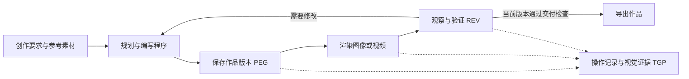

<div align="center">
  
  <h1>MaLiang-Harness</h1>
  <p><a href="README.md">English</a> | <strong>简体中文</strong></p>
  <p><strong>A Programmable Path to Image and Video Generation</strong></p>
  <!-- Add destination links around these badges when the publication URLs are available. -->
  <p>
    
    
    
  </p>
  <p>用多模态语言模型编写程序，生成图像与视频。</p>
  <p>
    <a href="#快速开始">快速开始</a> ·
    <a href="#对话创作">对话创作</a> ·
    <a href="#运行评测">运行评测</a> ·
    <a href="docs/USAGE.md">使用文档</a>
  </p>
</div>

MaLiang-Harness 用多模态语言模型编写绘图和动画程序，生成图像与视频。模型通过 Canvas、SVG、Three.js 等后端渲染画面，查看结果后继续修改代码。项目基于 Deep Agents，提供命令行、对话界面和批量评测工具。

我们关注的是代码与画面之间的差距：例如，程序没有报错，但物体的位置或运动仍然不符合要求。论文将这一问题称为 Program-to-Visual（P2V）Gap。为此，MaLiang-Harness 保存每次修改的程序版本及对应的渲染结果，让模型在后续修改中参考这些记录，并对准备导出的版本重新检查。

## 核心设计

| 设计 | 实现 |
| --- | --- |
| **PEG — Persistent Executable Generation** | 保存程序、素材、任务要求和计划，每次修改生成版本快照。 |
| **TGP — Traceable Generation Process** | 记录工具调用及其结果，并标记操作和渲染结果所属的版本。 |
| **REV — Revision-aware Editing and Verification** | 支持从历史版本恢复或创建编辑任务；修改后重新检查当前版本。 |



图像是在指定时刻渲染的画面；视频则按帧率连续采样程序中的运动。两者使用相同的版本管理方式，版本号随程序或计划的修改递增。

导出前，Harness 检查文件格式、尺寸、适用的结构约束，以及当前版本的检查点和视觉评审记录。视觉评审由模型完成，独立的质量评价需要另行进行。

## 功能

- 生成 PNG 图像和静音 MP4 视频，用代码控制构图、文字、材质和运动。
- 上传参考图，通过对话修改作品，或从历史版本开始新的编辑任务。
- 查看工具调用、渲染预览和代码变化；中断后可以继续原任务。
- 设置模型调用、工具调用、耗时和 token 预算。
- 按需接入图像生成服务，为程序提供素材；快速开始配置默认关闭此功能。
- 使用同一套评测工具运行不同模型，也可以添加工具和渲染后端。

| 后端 | 适用内容 | 依赖或边界 |
| --- | --- | --- |
| Canvas / SVG | 程序绘图、图形与排版 | Chromium |
| Scene2D | 对象、图层、关键帧与二维动画 | Chromium |
| SVG Animation / Three.js | 矢量动画、三维场景与运动 | Chromium；三维渲染需可用的图形后端 |
| Paint | 分层笔触、压力、柔边、涂抹与擦除 | 可选 libmypaint 原生库 |
| Pathtrace | 静物、材质、光照与路径追踪 | WebGL；当前提供 PNG 输出 |

能力说明与后端配置见 [使用详解](docs/USAGE.md)，工具协议和扩展方式见 [扩展说明](docs/EXTENDING.md)。

## 快速开始

### 1. 安装

建议使用 Python 3.12。克隆仓库后，在根目录执行：

```bash
git clone https://github.com/gulucaptain/MaLiang-Harness.git
cd MaLiang-Harness

python3.12 -m venv .venv
source .venv/bin/activate
python -m pip install -e '.[dev]'
python -m pip install --no-deps -e vendor/deepagents/libs/deepagents
python -m playwright install chromium
python -m pip check
maliang-harness doctor
```

项目使用固定版本的 Deep Agents 源码，来源见 [vendor/UPSTREAM.json](vendor/UPSTREAM.json)。网页前端和 Three.js / 路径追踪浏览器模块已提供构建产物，普通使用无需安装 Node.js。Paint 的额外依赖及安装方式见 [原生笔触绘画](docs/USAGE.md#原生笔触绘画libmypaint)。

安装依赖范围以 `pyproject.toml` 为准。[requirements/](requirements/README.md) 保留历史 Python 3.12 环境快照，供排查版本差异参考，不作为已验证的跨平台锁文件。

### 2. 先运行离线示例

```bash
python examples/scene_demo.py --project runs/scene-demo
```

该示例使用确定性脚本模型验证创作与渲染流程，**不调用模型 API**。请使用新的输出目录；生成文件保存在指定的 `runs/` 子目录中。这个示例用于检查安装，不代表真实模型的生成质量。

更多笔触绘画、路径追踪和端到端示例见 [examples/README.md](examples/README.md)。

### 3. 配置模型

选择具备工具调用能力的模型；视觉反馈还需要模型和接口支持图像输入。将你有权限使用的模型 ID 和凭据设为环境变量：

```bash
export OPENAI_API_KEY='YOUR_API_KEY'
export MALIANG_MODEL='YOUR_MODEL_ID'
# 使用兼容网关时，另行设置 OPENAI_BASE_URL。
```

主推理入口使用 Responses API。兼容服务必须支持对应的工具调用与多模态交互；Chat Completions 和模型专用适配器见 [评测指南](benchmarks/README.md)。不要将真实凭据提交到仓库。

### 4. 生成图像或视频

```bash
# 图像：快速开始配置关闭额外图像生成服务。
python inference.py --config examples/harness.quickstart.json \
  --model "$MALIANG_MODEL" \
  --prompt '绘制一张几何风格的山峰海报，使用深蓝、橙色和米白色'

# 视频：由程序定义运动，输出静音 MP4。
python inference.py --config examples/harness.quickstart.json \
  --model "$MALIANG_MODEL" --task video --duration 3 --fps 12 \
  --prompt '米白背景上，一个橙色太阳从左向右缓慢移动'
```

推理会调用真实模型 API，默认在 `runs/` 下创建独立任务目录。模型、预算、画布和可选素材服务由配置文件控制；参数说明可通过 `python inference.py --help` 查看。

## 对话创作

网页默认读取根目录 [harness.json](harness.json)。启动前，请设置其中的 `model.name`、预算和可选图像生成配置；网页不会自动采用上面的快速开始配置，也不会仅凭 `MALIANG_MODEL` 覆盖该配置中的模型名称。

```bash
python web.py --port 7860
```

打开 [http://127.0.0.1:7860](http://127.0.0.1:7860)：

- 在聊天界面输入创作要求，上传参考图，查看图片或视频结果并继续修改。
- 展开「创作过程」，查看实际记录的模型公开输出、工具操作和中间预览。它按事件更新，不是隐藏思维或逐 token 的 reasoning 流。
- 从左下角进入高级工作台 `/studio`，查看历史版本、代码差异，使用笔触绘画和路径追踪等入口。
- 在左侧删除创作时需要确认，确认后永久移除该任务的本地文件；独立的后续编辑任务保留。

前端源码、构建方式和上游归属见 [frontend/README.md](frontend/README.md)。

### 编辑与续跑

在网页中选择作品后，可以直接输入修改要求。CLI 也支持从指定版本创建新的编辑任务：

```bash
# 将路径和版本号替换为实际任务与版本。
python inference.py --edit-from runs/YOUR_RUN --revision 3 \
  --project runs/my-edit --model "$MALIANG_MODEL" \
  --prompt '保留构图，将背景改为深蓝色'

# 中断后继续同一个任务，沿用原作品与累计用量。
python inference.py --resume --project runs/my-edit --model "$MALIANG_MODEL"
```

编辑继承所选版本的规格、后端和素材。续跑不会清零预算；预算耗尽后需先调整相应累计上限。详见 [使用详解](docs/USAGE.md)。

## 运行评测

公共评测入口为 `python -m benchmarks`。各模型共用计划、调度、续跑和报告流程，provider 适配器负责接口差异。

```bash
cp benchmarks/models.example.json benchmarks/models.local.json
# 编辑模型 ID、接口类型、base_url 和 api_key_env。

python -m benchmarks plan \
  --config benchmarks/models.local.json \
  --dataset benchmarks/examples/tasks.jsonl \
  --batch benchmarks/results/first-run
```

`plan` 不调用 API：它校验并冻结输入任务、模型配置和源码指纹。仓库提供一个图像和一个视频示例任务，可替换为自己的 JSONL 数据集。

配置完成后执行：

```bash
export MODEL_API_KEY='YOUR_API_KEY'
python -m benchmarks run --batch benchmarks/results/first-run
python -m benchmarks report --batch benchmarks/results/first-run
```

`run` 会调用真实 API；`report` 汇总完成状态、技术有效性、耗时和用量，不调用模型。数据格式、模型适配器、并发、重试和无 API 自检见 [评测指南](benchmarks/README.md)。

### 与论文实验的关系

论文研究了程序可执行性与视觉质量之间的差距，在 50 个图像任务和 13 个视频任务上分别评估了 11 个和 4 个模型，并分别统计生成成功率、视觉质量和计算成本。

仓库提供评测执行与报告工具。论文的完整数据集、历史生成结果和完整视觉评分流程暂未包含在此次发布中。 公共 `report` 的完成率不是论文中的视觉质量达标率。复现实验还需要对应任务、模型版本、预算、适配器与评分协议；不同配置下的结果应分别说明。

## 代码组织

| 路径 | 内容 |
| --- | --- |
| `src/maliang/` | Agent、作品状态、版本存储、验证与渲染工具 |
| `frontend/` | React 对话界面源码与构建说明 |
| `web/`、`web.py` | 已构建网页、高级工作台与本地 HTTP 服务 |
| `examples/` | 离线演示、任务规格与快速开始配置 |
| `benchmarks/` | 公共评测引擎、provider 适配器与输入示例 |
| `tests/` | Harness 回归测试 |
| `docs/` | 使用与扩展文档 |
| `vendor/` | 固定版本的第三方源码与来源记录 |
| `requirements/` | 历史 Python 依赖快照及说明 |

运行产生的作品、素材、证据、日志和 checkpoint 写入任务目录；`runs/` 与评测结果目录默认被 Git 忽略。

## 开发与贡献

欢迎通过 Issue 报告问题或通过 Pull Request 改进实现。复现问题时，请提供执行命令、模型接口类型、脱敏配置、错误信息和最小示例；无需上传密钥或完整私有运行记录。

```bash
python -m pytest -m 'not rendering'
python -m pytest -m rendering
python -m ruff check src tests benchmarks examples scripts inference.py web.py
```

渲染测试需要 Chromium，绘画测试还需要 libmypaint。测试使用离线模型或模拟接口。前端修改后运行 `npm --prefix frontend ci` 和 `npm --prefix frontend run build`，并一并更新构建产物。

## TODO

- [x] 发布论文
- [x] 发布代码
- [ ] 搭建用户作品提交网站

## 论文引用

如果你的研究使用了 MaLiang-Harness，请引用以下论文。arXiv 编号将在论文上线后补充。

```bibtex
@misc{zhao2026maliangharness,
  title         = {{MaLiang-Harness}: A Programmable Path to Image and Video Generation},
  author        = {Haoyu Zhao and Zihao Zhang and Xudong Wang and Jiaxi Gu and Zuxuan Wu and Shuicheng Yan},
  year          = {2026},
  eprint        = {},
  archivePrefix = {arXiv}
}
```
