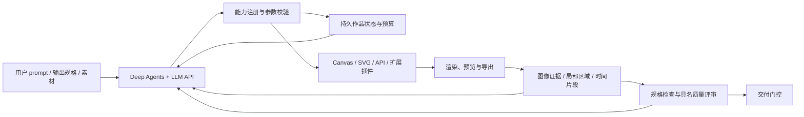

# MaLiang-Harness 使用与实现详解


基于 Deep Agents 的图像与视频创作 Harness。用户输入创作要求，由 LLM 选择工具、编写视觉程序、观察预览、修改作品并导出。核心接口不依赖某一种画布：当前包含对象级 scene2d 动画、Canvas 动画、SVG 静态图、素材导入和可选的图像生成 API。默认只需 LLM API，程序化图像和视频均不需要图像生成 API。

这是可运行的研究原型。框架与离线集成测试已经实现；真实模型创作质量、与基线的优势及原始约 50 秒案例的完成度，需要配置模型后进行实验。

## 当前增强：对象控制与程序视频

新任务默认采用 `guided` 流程：能力说明 → 创作计划与要求拆解 → 对象/程序操作 → 针对要求的观察 → 评审与检查点 → 导出交付。

新增 `scene2d` 后端将对象绑定到独立绘制函数，Harness 直接执行位置、缩放、旋转、透明度、图层和关键帧；支持局部对象观察、版本前后像素比较和草稿原因报告。原有运行目录按 `legacy` 规则读取，不改写历史结果。

- 真实模型视频入口：`./inference.sh --task video --prompt '你的动画要求'`；复杂任务可用 `--spec examples/scene_video_task.json`
- 无 API 的完整机制演示：`.venv/bin/python examples/scene_demo.py`

## 代码底座

Deep Agents 源码位于 `vendor/deepagents`，固定提交见 [vendor/UPSTREAM.json](../vendor/UPSTREAM.json)。通过 editable 安装直接使用该源码的 `create_deep_agent`、工具循环、上下文压缩、待办和虚拟笔记文件系统。LangGraph SQLite checkpointer 提供恢复能力。上游源码保持原样，领域能力位于 `src/maliang`。



## 安装

建议 Python 3.12。以下命令均在 `MaLiang-Harness/` 目录执行。此目录仅包含代码，需重新创建虚拟环境并配置 `.env`。项目名称统一为 `MaLiang-Harness`；Python 包名为 `maliang`，命令行入口为 `maliang-harness`（也可使用简写 `maliang`），环境变量前缀为 `MALIANG_`。

新环境执行：

```bash
cd MaLiang-Harness
python3.12 -m venv .venv
source .venv/bin/activate
python -m pip install -e '.[dev]'
# 保证使用已下载的 Deep Agents 源码，而不是仅使用 PyPI 包：
python -m pip install --no-deps -e vendor/deepagents/libs/deepagents
python -m playwright install chromium
python -m pip check
maliang-harness doctor
```

若 `vendor/deepagents` 不存在，先执行：

```bash
git clone https://github.com/langchain-ai/deepagents.git vendor/deepagents
git -C vendor/deepagents checkout bc3c2935650f8e8a0862d51226d986d842bd3824
```

Playwright 与 PyAV 固定在兼容本机 macOS 13 的版本。PyAV wheel 自带视频编解码依赖，无须使用系统 FFmpeg 命令。若已有可用 Chromium，可通过 `MALIANG_CHROMIUM` 指向其可执行文件。历史 Python 3.12 环境快照见 [requirements/python312-snapshot.txt](../requirements/python312-snapshot.txt)；该快照未经过全新环境和跨平台安装验证，常规安装仍使用上面的 editable 命令。

## 不使用 API 的集成演示

```bash
source .venv/bin/activate
maliang-harness demo runs/offline-demo
maliang-harness report runs/offline-demo
```

演示经过真实 Deep Agents 图循环，故意提交错误程序，再修正、预览和导出三秒水墨锦鲤 MP4。绘画程序与决策序列是预先编写的测试 fixture，**不代表 LLM 生成，也不是质量评测**。`status.json` 包含 `export_id`，对应 `evidence/<id>.json` 中的 `paths` 可找到输出。每个新任务使用新的项目目录。

## 一键推理入口

### 本地网页观察台

若一次模型调用超时，页面会明确显示“模型 API 请求超时”；它不等于 DNS 或密钥无效。当前单次调用上限为 300 秒，仍由 `model.timeout_seconds` 控制。可先运行 `./inference.sh --check-api` 检查最小请求，再从网页续跑。最小请求成功不保证长请求一定完成。

在项目目录启动服务，然后在浏览器打开 `http://127.0.0.1:7860`：

```bash
.venv/bin/python web.py
# 可选：.venv/bin/python web.py --port 7861
```

页面可输入 prompt、选择图像、视频、笔触绘画或写实渲染并启动一次真实推理。运行过程每秒刷新：LLM 每次完整回复及工具调用、工具参数中的 JS/SVG 源码、累计模型/工具/生图调用数、token 用量、每次画布渲染的 evidence，以及图像生成的素材。右侧也显示原入口的终端输出。运行数据保存在 `runs/web-*`，可继续用 `maliang report` 或 `./inference.sh --resume --project runs/web-*` 检查和续跑。服务仅监听本机 `127.0.0.1`；trace 包含完整创作内容与代码，请勿向公网暴露。模型回复会在**每次 API 调用完成时**出现，非逐 token 流式输出。

网页使用 Python 标准库，无需额外安装 Gradio。页面同时只启动一个任务，服务重启后可从“查看历史任务”加载已保存的过程。失败任务可点击“续跑当前任务”，沿用原始要求、作品和累计预算。网页会显示模型等待时间、具体错误和逐次工具输出，终端日志保存在 `runs/.web-logs/`。历史事件分批加载直到读完。

在项目目录执行 `./inference.sh`，默认使用 `harness.json` 的 `image.prompt` 生成 PNG。当前配置没有 `video` profile；`--task video` 会使用内置视频默认值，也可自行添加 `video.prompt` 和 `video.output`。`--prompt` 或 `--prompt-file` 传入的用户要求会覆盖选中类型的默认 prompt。`inference.sh` 仅负责定位项目与启动 Python；配置加载、任务创建、推理和结果汇总均在 `inference.py` 中实现。脚本自动使用本地虚拟环境，读取项目根目录的 `harness.json`，并从 `.env` 读取密钥及端点；已有环境变量优先，不会自动读取 `.env.example`。每次新建唯一任务目录，结束后显示状态及输出路径。

```bash
./inference.sh --check                          # 仅检查，不调用 API
./inference.sh --check-api                      # 实际请求模型，检查连接和权限（可能产生少量费用）
./inference.sh --task image                     # 使用 image.prompt 和 image.output
./inference.sh --task image --prompt '绘制一张水墨山水画'
./inference.sh --task video --prompt '太阳升起并缓慢越过群山'
./inference.sh --task video                     # 当前配置未指定 video，使用内置默认值
./inference.sh --spec examples/pond_task.json    # 三秒视频
./inference.sh --config harness.json --spec examples/scene_video_task.json
./inference.sh --prompt-file ../cases1.txt --format mp4 --duration 50
./inference.sh --resume --project runs/你的任务目录
```

长视频应按实际任务设置尺寸、帧率和累计预算。`--spec` 已包含自己的 prompt、输出规格、后端与素材权限，使用时不要同时传 `--task`；已有任务续跑沿用保存的任务要求。命令行 `--model`、`--mode`、`--budget`、尺寸等参数可临时覆盖配置，`--budget` 接受原有预算 JSON 文件。为兼容旧命令，仅指定 `--format mp4` 而不指定 `--task` 时，也会选中 `video` 配置。退出码 0 表示完成门控通过或基线已导出，2 表示尚未交付；配置或执行错误返回非零状态。`--check` 只检查本地配置；`--check-api` 发送一次最小模型请求，可区分连接、认证、模型权限等问题。若终端设置了 `https_proxy` / `HTTPS_PROXY`，请求会经过该代理。

### `harness.json` 配置说明

项目根目录的 `harness.json` 管理运行策略，可分别配置图像与视频任务；当前文件只显式配置了图像，不保存 API key。默认输入 token 累计上限为 1,200,000；这是 Harness 停止任务的阈值，不是服务商额度。提高上限会允许更多付费模型请求。每次运行的**实际**模式、模型、模型参数和预算会写入该任务的 `run_config.json`；`usage.json` 记录累计消耗。续跑时重新读取当前 `harness.json`（或显式 `--budget`），但保留已用额度。

| 配置项 | 含义 |
|---|---|
| `mode` | `maliang` 启用规划、观察、检查点及交付门控；`generic-agent` 和 `single-shot` 是对照模式。 |
| `model.name` | 实际请求的 LLM 模型 ID；命令行 `--model` 可覆盖。 |
| `model.timeout_seconds` | 正式运行时单次模型 API 请求的超时秒数；`--check-api` 的单次请求最多等待 15 秒且不自动重试。 |
| `model.max_retries` | SDK 对单次失败请求的自动重试次数；不含 Harness 自己的模型调用次数。 |
| `model.max_output_tokens_per_call` | 单次模型回答可使用的最大输出 token；与下面的累计输出预算不同。 |
| `budget.max_model_calls` | 一个任务累计允许发起的模型调用次数。 |
| `budget.max_tool_calls` | 一个任务累计允许执行的 Harness 工具调用次数。 |
| `budget.max_frames` | 预览、观察和导出累计渲染的帧数上限；不是视频总帧率。 |
| `budget.max_seconds` | 一个任务累计运行的墙钟时间上限，续跑时继续累计。 |
| `budget.max_input_tokens` | 所有模型调用累计发送的输入 token 上限；历史消息变长会使每次调用消耗增加。 |
| `budget.max_output_tokens` | 所有模型回答累计产生的输出 token 上限。 |
| `image.prompt` / `video.prompt` | 各任务类型的默认创作要求；用户传入 `--prompt` 或 `--prompt-file` 时被覆盖。 |
| `image.output` / `video.output` | 各自的画面规格：`width`、`height` 为像素尺寸，`duration` 为秒数，`fps` 为每秒帧数，`seed` 为随机种子。图像的 `format` 固定为 `png`，视频固定为 `mp4`；MP4 宽高须为偶数。 |
| `image.allowed_backends` / `video.allowed_backends` | 该类型允许模型使用的画布后端，如 `scene2d`、`canvas`、`svg`；视频默认使用支持动画的 `scene2d` 和 `canvas`。 |
| `image.allow_generated_assets` / `video.allow_generated_assets` | 该类型是否允许调用图像生成素材 API；还须启用 `image_generation.enabled` 并配置对应密钥。视频输出仍由绘制后端渲染。 |

`OPENAI_API_KEY`、`OPENAI_BASE_URL`、`DASHSCOPE_API_KEY` 和可选的 `MALIANG_CHROMIUM` 仍放在 `.env` 或进程环境中。若 `.env` 也含 `MALIANG_MODEL`，`harness.json` 的 `model.name` 优先。终端代理环境变量由操作系统或 shell 管理。复杂任务的硬性要求和时序观察可写入任务文件，例如 `examples/scene_video_task.json`；该文件中的 prompt 和规格优先于图像/视频默认配置。

已有任务要提高累计预算，直接修改 `harness.json` 中的 `budget.max_input_tokens` 后执行 `./inference.sh --resume --project runs/任务目录`。若命令中带了 `--budget examples/guided_budget.json`，则该文件的预算**覆盖** `harness.json`；不会自动合并。续跑不能改变原任务的 `mode`、prompt 或画面类型。低层命令 `maliang init/run` 在项目目录运行时也读取 `harness.json`，或通过 `--harness-config 路径` 指定另一份配置；`maliang init --task video runs/目录` 可直接使用视频默认 prompt。

## 接入真实 LLM

在 shell 中显式配置，或在项目目录的 `.env` 中填写；`inference.sh` 会自动读取 `.env`。

```bash
export OPENAI_API_KEY='你的 key'
# 模型 ID 默认配置在 harness.json 的 model.name
# 可选兼容端点：必须支持 Responses API 和多模态工具输出
# export OPENAI_BASE_URL='https://你的兼容端点/v1'

maliang-harness init runs/my-pond --spec examples/pond_task.json
maliang-harness run runs/my-pond
maliang-harness report runs/my-pond
```

也可以只给一个 prompt：

```bash
maliang-harness init runs/poster --format png --width 512 --height 512 \
  --prompt '画一张米白背景、橙色太阳与深蓝山峰的几何海报'
maliang-harness run runs/poster
```

CLI 默认添加“原始要求满足情况”的视觉检查。复杂任务建议使用 `--spec` 将关键内容、风格和时序要求显式列出，避免模型自己拆解时遗漏要求。SVG 示例：`maliang init runs/svg --spec examples/svg_task.json`。

素材辅助创作：将参考图片复制到任务目录，告诉模型其相对路径，模型可使用 `import_asset`。返回的素材具有固定 ID、哈希与来源，由绘制代码中的 `assets[id]` 使用。Qwen 接入及分工流程见下面说明。旧的 `MALIANG_IMAGE_MODEL` + `OPENAI_API_KEY` 仅作为没有显式生图配置时的兼容路径；显式关闭新配置不会悄悄回退到旧接口。

## 恢复、观察与复用

```bash
# 保留作品、历史消息、checkpoint 和累计使用量继续运行
# 达到预算后，提供更高的累计预算才能继续
 maliang-harness run runs/my-pond --resume --budget examples/budget.json

# 查看可调用接口及后端契约
 maliang-harness capabilities runs/my-pond

# 人工评价：evidence-id 来自当前版本的 evidence 文件
 maliang-harness review runs/my-pond ink_style evidence-id --verdict pass \
  --explanation '已查看实际渲染结果，纸纹稳定且笔触清晰'

# 将已有作品的程序、对象、时间线和素材复用到新任务
 maliang-harness init runs/variation --spec examples/pond_task.json
 maliang-harness reuse runs/variation runs/my-pond
 maliang-harness run runs/variation
```

复用保留新任务的 prompt、规格、要求和工具限制；旧作品的评审结果不会被复制。时间线超出新任务时长、后端不被允许或生成素材被禁止时，会拒绝不兼容的复用。

## 实验入口

为同一个任务分别创建三个目录，再使用：

```bash
# 对照任务需先分别 init，single-shot / generic-agent 使用 --workflow legacy
# 新版 inference.sh 会按 --mode 自动选择 guided / legacy。
maliang-harness run runs/experiment-a --mode single-shot
maliang-harness run runs/experiment-b --mode generic-agent
maliang-harness run runs/experiment-c --mode maliang
```

- `single-shot`：一次模型调用返回程序，然后执行导出；不进行视觉修正。
- `generic-agent`：相同 Deep Agents 和主要绘制/预览/对象操作工具；移除领域检查、检查点和版本恢复工具，不注入持续检查结果。
- `maliang`：完整的状态、观察、反馈、恢复和交付门控。

`generic-agent` **是去掉部分机制的初步消融基线**，仍共享作品存储和接口，不是定义文档中完整的“任意代码执行通用 agent”对照。正式论文实验还需建立该独立强基线、预算对齐和盲评流程。`baseline_exported` 只表示有导出，不能当作任务成功；`completed` 表示当前门控通过，也不能替代独立质量评测。`draft` 表示有草稿但质量要求或检查流程未完成，报告会列出未满足要求。

## 源码与运行数据

| 路径 | 职责 |
|---|---|
| `harness.json` / `src/maliang/settings.py` | 全局运行配置及其字段校验 |
| `src/maliang/agent.py` | 接入 Deep Agents、主模型、上下文注入、预算、恢复与对照入口 |
| `src/maliang/models.py` | 作品、对象、事件、资源、要求、证据和预算模型 |
| `src/maliang/store.py` | 版本、内容寻址文件、哈希校验、评审与操作记录 |
| `src/maliang/capabilities.py` | 领域工具及多模态观察返回 |
| `src/maliang/adapters/` | 绘图后端、素材与生成 API |
| `src/maliang/verification.py` | 规格、结构、视觉/时序评审覆盖与交付检查 |
| `src/maliang/reuse.py` | 跨项目内容复用，包括对象绘制函数 |
| `src/maliang/scene_tools.py` | 对象创建、变换、关键帧、单对象代码读取 |
| `src/maliang/scene_runtime.js` | 对象代码执行、时间采样与图层合成 |
| `src/maliang/guidance.py` | 能力状态说明与紧凑进展上下文 |
| `src/maliang/workflow.py` | 要求观察、检查点、前后比较、草稿记录 |
| `docs/EXTENDING.md` | 新增工具和渲染后端的接入契约 |

运行目录保存 `artwork.json`、`versions/`、`blobs/`、`cache/`、`evidence/`、`reviews/`、`outputs/`、`trace.jsonl`、`usage.json`、`validation.json`、`status.json`、`checkpoints.sqlite`。在工具输出中，预览作为真正的图像内容传入模型，而不是只返回本地文件路径。

```bash
pytest -m 'not rendering' -q
pytest -m rendering -q
ruff check src tests
```

真实 API 没有在测试中调用。渲染测试会启动本机 Chromium。浏览器限制网络且不接收模型 API 密钥，但该执行环境是本地研究用隔离机制；公开部署应把渲染 worker 放进独立容器。


### 按元素规划、由代码主导的创作链路

当前 `harness.json` 使用 `image_generation.workflow: "code_directed"`。LLM 在第一次规划时拆解用户 prompt，为每个元素保存 `components`：`object_id`、`route`、`reason`、`code_strategy`、`integration` 和 `requirement_ids`。路线为 `code`、`generated_background`、`generated_subject` 或 `generated_texture`。组件还可用 `control_requirements` 说明独立动作、编辑及静态环境分组需求。例如窗台、窗框、光照与构图采用代码；猫的精细毛发可选局部主体素材，并说明为什么代码绘制不适合以及如何合成。模型可根据观察重新规划，但不能削弱已有验收要求。

系统提示词现要求先完成并观察有实质内容的代码场景，针对观察到的缺陷先尝试代码修正，仍无法解决时才重新规划局部生图素材。构图占位图不能作为调用 Qwen 的依据。一般创作不得用整张生成底图替换代码场景；只有用户明确要求或批准生成整张图时才能选择该路线。每个生成任务仍须对应规划中的底图、主体或纹理；主体和纹理须声明局部 `target_region`，面积不得超过 `max_repair_area_fraction`。这属于模型提示词约束，框架目前没有从最终像素比例自动判定代码贡献，仍需查看计划与最终结果。

目前已接通 `scene2d`（对象级 JavaScript Canvas）、Canvas、SVG。生成素材绑定到可控图层目前需要 `scene2d`；纯代码任务可以选 Canvas/SVG。Three.js/WebGL 已通过本地 `three` 后端接通，须在任务允许的后端中启用；不允许在线导入外部库。`paint` 后端提供原生 libmypaint 笔触绘画；`pathtrace` 后端提供结构化场景与 WebGL 路径追踪 PNG。视频继续由代码控制时间轴、对象变换与逐帧输出，没有接入真实视频生成 API。

旧 `code_first_repair` 策略仍可选：先代码草稿，再引用当前失败观察做局部修复。`planned_assets` 仅用于旧实验兼容。续跑会保留运行目录里的生图策略快照；要测试新规划链路，应新建一次运行。

主体局部修复仍设 `extraction: "white_background"`，让 Qwen 尽量生成独立主体。模型实际可能给出灰底或黑底。LLM 调用 `inspect_asset` 时能同时看到图片、边缘接近白色的比例和背景色概况，然后选择处理方式：真正纯白的素材可用 `extract_white_background`；灰底、黑底可用 `extract_subject(method="border_color")`；白毛被误删时可用 `hybrid` 并给出图内前景保护区域，或用 `polygon` 在原图像素坐标描出主体外轮廓。不同参数生成不同派生素材 ID，始终复用同一张已付费的原图。

抠图后应 `inspect_asset` 查看透明素材，再用 `preview_cutout` 预览它在代码场景中的效果。预览会临时隐藏原先代码画的猫，因此透明缺口会显露真实背景。选择满意的版本后 `place_cutout`：它按主体范围裁去空白边，保持宽高比，将主体底部对齐到规划区域，并只替换目标对象；其余代码图层保留。再用 `observe_requirement`、`compare_versions` 和最终验收检查整体。试贴预览不能充当最终画面验收证据。

这些抠图方法是启发式图像处理，并非语义分割。自动边缘颜色法能处理上次 Qwen 返回的两张灰底猫，但离线预览也发现白脸、白胸毛可能被一起删除；必须用前景保护或轮廓方案修补并检查毛发、胡须、爪子和阴影。工具会保留 Qwen 原图，抠图失败或参数不佳无需再次调用 Qwen。现在的视频仍由代码生成时间轴并编码 MP4，静态猫素材无法形成真实的走路或转头动作。

| 配置项 | 含义 |
|---|---|
| `image_generation.enabled` | 是否开放生图适配器；任务还需要 `allow_generated_assets: true` 和对应密钥。 |
| `image_generation.workflow` | 当前 `code_directed`：先按元素判断代码/主体素材/纹理，再由代码合成；`code_first_repair` 保留失败观察后修复的策略；`planned_assets` 兼容旧实验。 |
| `image_generation.max_repair_area_fraction` | 单次规划修复区域相对整张画布的最大面积，当前为 0.6。 |
| `image_generation.cutout_default_tolerance` | 边缘颜色法默认容差，当前为 40；LLM 可按单张素材调整 `extract_subject.tolerance`。越大越可能把白毛也判为背景。 |
| `image_generation.cutout_default_feather_px` | 抠图边缘默认羽化像素，当前为 0.8；LLM 可按单张素材调整 `extract_subject.feather_px`。 |
| `image_generation.provider` / `model` | 当前为 `qwen` / `qwen-image`。异步 Qwen 适配器还支持 `qwen-image-plus`；`openai` 保留 b64 素材适配器。 |
| `image_generation.api_key_env` | 密钥环境变量名称；当前使用 `DASHSCOPE_API_KEY`。实际密钥放在 `.env` 或进程环境。 |
| `image_generation.base_url` | DashScope 原生 API 的 HTTPS `/api/v1` 根地址；需与密钥所在地域相符。 |
| `image_generation.size` / `prompt_extend` | Qwen 素材尺寸和服务端提示词扩写，独立于最终画布尺寸。 |
| `image_generation.timeout_seconds` / `poll_interval_seconds` | 单次生图工具超时及异步任务轮询间隔。 |
| `budget.max_asset_api_calls` | 一个任务累计允许的新生图提交次数；轮询同一个已保存的任务不增加计数。 |

运行入口仍是 `./inference.sh --task image` 或 `./inference.sh --task video`。各类型如在 `harness.json` 配了对应 profile，就读取 `image.prompt` 或 `video.prompt`；缺失时使用内置默认值，`--prompt` 可指定自己的任务。旧运行目录保存了当时的生图策略与任务权限；新建运行可完整测试链路。真实推理会使用付费 API，由用户手动执行。离线单元及渲染测试使用模拟素材，不产生模型费用。

检查结果可看任务目录内的 `artwork.json`（代码草稿、失败观察对应的素材计划）、`trace.jsonl`（调用顺序）、`reviews/`（评估）、`asset_jobs/`（Qwen 任务）、`usage.json`（调用预算）和 `outputs/`（最终输出）。模型评估是自评，仍需人检查细节。Qwen 协议参考 [官方异步 API 文档](https://www.alibabacloud.com/help/zh/model-studio/qwen-image-api)。

### 减少模型往返与自由合成

`compose_asset` 接受模型编写的 `function(ctx,t,object,assets,random)`，绑定到规划中的目标对象，并在规划区域内裁切。模型可控制素材取样、裁剪、大小、位置、透明度、混合、光影和随时间变化的效果。主体必须先抠成透明图；纹理可使用原始素材。其他代码图层和对象的运动轨迹保留。简单贴图仍可用 `place_cutout`；`compose_asset` 后直接观察真实场景，不强制使用固定贴图预览。自定义函数必须平衡 save/restore，不能重置外部变换或裁剪。

新增 `execute_steps`，一次 LLM 决策最多执行 16 个已确定的领域操作。每个子步骤照常校验、计预算、写日志，自动使用最新 revision，遇错停止，保留此前成功步骤；它不是原子事务。可以把“规划+多个图层写入”“生图+查看”“抠图+查看+试贴”“多个观察”分别成组，最后把“多个评审+检查点+导出+finalize”合并。最后的 `finalize_artwork` 参数可写 `export_id: "$latest_export"`。需要看中间结果才能做的判断必须留到下一轮，不允许预先为尚未见到的画面写通过评审。

每次模型请求已携带能力与当前场景摘要，通常无需开头再单独调用三个发现工具。历史检查点完整保存；发送给模型时只保留最近四个含图工具消息的图片，旧证据的文字与文件仍保留，可重新观察。组内重复图片只发送一次。完成后不再付费调用模型写结束语。这些改动减少可避免的往返与重复图片；实际耗时仍取决于用户要求、素材质量和模型响应，尚未进行真实 API 速度对比。

| 效率配置 | 含义 |
|---|---|
| `efficiency.max_batch_steps` | 一次 `execute_steps` 可执行的最大子步骤数，当前 16，范围 1–16。降低它可缩小每组操作的范围。 |
| `efficiency.recent_image_messages` | 发给 LLM 的历史中保留最近多少个含图工具消息，当前 4，范围 1–16；一个消息可能包含多张图。提高它能保留更多视觉上下文，但增加输入量。 |

效率配置也写入 `run_config.json`；续跑时允许从当前 `harness.json` 调整它们，不会改动已经保存的任务要求和生图策略。

### 初始规划时克制生图

当前配置启用 `image_generation.conservative_planning: true`（仅 `code_directed` 策略）。LLM 默认以代码绘制主体、环境和细节；复杂、写实或强调绘画质感本身都不能作为初始生图理由。先渲染并检查完整代码画面，针对具体缺陷修正代码；确有局部缺口时才重新规划最小范围的生成素材。不得故意制作低质量代码稿来制造生图理由。整张环境底图仅用于用户明确要求或批准的情况。

| 配置 | 含义 |
|---|---|
| `image_generation.conservative_planning` | 当前为 `true`；初始规划和实际生图前均校验生成组件的必要性说明。配置类默认 `false`，用于兼容未包含该字段的旧运行快照。 |
| `image_generation.max_generated_components` | 保守模式下，一份当前计划允许的生成组件数量上限，当前为 `1`；`0` 表示只能选择代码。它是上限，不是必须使用的配额；不等于 API 次数预算，后者仍由 `budget.max_asset_api_calls` 控制。 |

生成组件必须填写 `brief_evidence`（引用原始用户 prompt）、`code_limitation`（具体代码视觉能力缺口）和 `minimal_scope`（最小生成范围）。框架检查引文来自原始需求、说明完整及组件数量上限，不会自动证明理由在视觉上成立；语义必要性仍由 LLM 判断，可在 `artwork.json` 中审计。纯代码组件无需这些额外说明。该机制不增加额外 LLM 审批轮次。

旧任务续跑沿用保存的生图配置；新任务直接运行 `./inference.sh --task image` 使用新策略。


### 环境底图与独立代码对象

`code_directed` 工作流现在支持：分析控制需求 → 代码构图/角色草图 → 规划并生成环境底图 → 观察底图 → 等比合成 → 对齐代码角色 → 观察与验收。
仅使用现有文生图接口；构图草图不会作为图像输入传给模型，位置约束通过文本描述，生成结果必须重新观察。

- `plan_creation.components[].route = generated_background`：允许将静态环境、支撑物、地面和光照一起生成。填写 `control_requirements` 解释这些内容为何可绑定为静态图层。
- `plan_asset.task.role = background`、`extraction = none`，`target_region = [0,0,width,height]`。`background_layout` 必须包含 `static_contents`、`excluded_object_ids`（代码对象 ID）、`camera`、`lighting`、`reserved_regions`（按对象 ID 指定像素矩形）；`anchors` 可声明预期接触点。
- Qwen 底图自动从已有支持尺寸中选择最接近画布宽高比的一档；局部主体/纹理仍使用配置尺寸。`inspect_asset` 返回原图和居中 cover 裁切区域。
- `place_background(asset_id, observed_anchors, layout_notes, expected_revision)`：提供观察后在最终画布坐标中测量的接触点与布局评价。工具保持比例、居中裁切、置于其他对象下方，并在对象 properties 保存来源、裁切与布局记录；不做抠图。
- 生成的预留空间和接触位置只是视觉约束，工具不会自动证明其正确。应在 `plan_creation` 中加入布局、接触、透视/光照与必要遮挡要求，最后用现有场景 evidence 验收。底图不合适时用新 asset ID 生成替代图，再重新测量接触点；新修订会使旧评审失效。
- 静态底图没有深度、自动前景遮挡或新的视角。独立运动不能由整张底图平移替代；需要此类控制的内容应单独规划。`code_first_repair` 保留原来的局部修复约束。

网页仍通过 `generate_asset` / `inspect_asset` / `place_background` 的事件与素材画廊展示整个过程。重启服务后新建任务即可使用；不需要安装额外模型。


### 降低调用开销而保留视觉反馈

- `observe_requirements(requirement_ids=[])` 一次观察全部要求，也可传 ID 列表。每项要求继续获得自己的 evidence ID；对象裁切、区域和时序采样规则不变。相同图片在本次工具返回中只发送一次。模型看完后仍须分别评价每项要求；失败时继续修改与观察。
- `execute_steps` 在 `batches/` 保存操作。失败返回 `resume_batch_id`；用 `resume_steps(expected_revision, batch_id, replacement_args)` 修正失败操作的顶层参数并继续。未执行的 JS 原样复用，成功步骤不重放；场景 revision 已变化时拒绝恢复旧批次。不会自动跳过错误或自动重试付费生成。
- 引用原始要求时允许外围中英文引号，仍拒绝不在原始要求中的内容。底图观察允许额外有效接触点，仍要求全部计划接触点齐全、所有坐标在画布范围内。
- 发给模型的请求只合并内容完全相同的近期图片；不同图片与全部观察文字保留，完整 checkpoint 不改写。原有近期图像窗口设置继续生效。
- 网页按内容哈希合并相同预览，显示“复用已有画面”，仍保留每项 evidence、操作记录及文件链接。

这些优化不设置更低的模型调用上限，不削减图像分辨率、角色源码、要求数量或视觉评审。实际节省多少调用取决于模型执行情况，需在真实任务中测量。

### 原生分辨率与清晰度

新任务在创建不可变规格之前确定画布尺寸，所有绘图、坐标、裁剪和导出使用同一个原生像素网格；不是在导出后放大 PNG。

- 当前 `harness.json` 默认图像为 2048×1152，视频为 1280×720。旧配置仍沿用各自的尺寸。
- 网页可选择自动/横版/竖版/正方形，以及配置默认/标准/高清。标准长边：图像 2048、视频 1280；高清长边：图像 3072、视频 1920。
- 自动方向识别明确的中英文画布方向描述；多个方向冲突或没有明确说明时保留配置比例。复杂语义请使用网页方向选项。
- CLI 同样支持 `--orientation portrait --resolution high`。显式 `--width` / `--height` 优先，未提供的一边沿用配置值。完整 `--spec` 和 `--resume` 保持原尺寸，不能同时指定新的尺寸选项。
- PNG 每边最多 4096；MP4 每边最多 1920 且必须为偶数，时长/帧率/帧预算限制继续生效。高清需要更多渲染时间、内存和存储。

新建自然语言任务增加 `render_clarity` 视觉验收：查看全图及原生细节裁剪，检查文字、细线与素材放大质量；视频还需检查不同时间的画面和编码结果。该项复用已有观察/批量评审机制，不接入额外模型；实际评审仍会占用原有 LLM 的调用预算。

Canvas、scene2d、SVG 预览的 `frame_details.clarity` 提供字号诊断，小于 12 输出像素时记录示例。Canvas 计算包含绘图变换和 `maxWidth` 压缩；这只是绘制时估计，可能包含被遮挡或离屏文字，不能追踪任意离屏画布再次合成后的尺寸，不能识别位图内的文字，也不能证明最终可读。正文建议至少 16px，密集中文建议至少 20px，模型仍须通过实际图像验收。

Image generation 保留现有底图/主体/纹理工作流。高分辨率画布不会恢复生成素材中不存在的细节；精确文字、数字与细线优先在代码/SVG 中绘制，底图尽量不含需要阅读的文字。旧任务不会自动重绘；重启网页服务后提交新任务即可使用这些设置。

### 文本 / 图像输入的视频创作

网页运行方式保持不变：

```bash
.venv/bin/python web.py
```

打开 `http://127.0.0.1:7860`，选择 **视频生成**，输入创作要求、时长和帧率；可选上传一张 PNG、JPEG 或 WebP。图像任务也支持上传。图像须为单帧、小于 10 MB、最多 1600 万像素；会处理 EXIF 方向、规范化为 PNG，并作为不可变 `input_image` 素材保存。上传文件先放在 `runs/.web-inputs`，不会提前占用新任务目录。上传图像不要求开启 Image generation。

模型在首次请求中能看到输入图像。Canvas/scene2d 可用 `assets.input_image` 绘制；SVG 动画使用它的 `.src`；three.js 可创建 `THREE.Texture(assets.input_image)`。模型根据用户要求将它作为参考图或合成底图，不默认替换成生成图像。续跑保留原始输入、时长和帧率。

```bash
.venv/bin/python inference.py --task video --prompt '在这张照片上绘制移动路线，镜头缓慢推近，并依次出现说明文字' --input-image /absolute/path/photo.png --duration 12 --fps 24
```

网页时长范围 1–120 秒，帧率范围 1–30（提供 12/24/30 选项）；任务还受现有帧预算、运行时间和 token 预算限制。当前视频默认 24 fps。提交前会检查成片最低帧数是否超过帧预算；预览和修正也消耗预算。视频最终尺寸仍由方向与分辨率选项决定。

#### 代码绘制后端

- `scene2d`：保留原有对象工具、图层和变换关键帧。适合对象控制和 Image generation 素材合成。
- `canvas`：`function(ctx,t,scene,assets,random){...}`，适合大量程序图案、图像叠加和自定义二维动画。
- `svg_animation`：`function(t,scene,assets,random){return '<svg ...>...</svg>'}`，逐时间点产生 SVG；保留静态 `svg` 后端兼容旧图像任务。SVG 禁止脚本、外链、CSS/SMIL 自动播放，动画属性由绝对时间计算。图片只允许内嵌 PNG/JPEG/WebP。
- `three`：`function(THREE,renderer,artwork,assets,random){return {scene,camera,update(t){...}}}`。本地固定 three.js 0.180.0，运行时不访问 CDN；需要 Chromium WebGL2，可使用软件渲染。初始化几何/材质，`update(t)` 明确设置状态，harness 负责渲染和编码。版本、来源、校验和及 MIT 许可证在 `src/maliang/vendor/three/`。

每个任务选择一个主后端；Canvas 可绘制导入图像，three.js 可使用 CanvasTexture。不是所有后端自动互相转换。现有生成素材的规划/放置工作流仍使用 scene2d；用户上传图像可用于所有动画后端。新运行时提供 `motion.progress`、`smooth`、`lerp`、`cycle` 和按 seed/index 取值的 `random`，辅助代码实现确定性的运动；不使用墙钟或 `requestAnimationFrame`。

#### 计划、预览与交付

视频的 `plan_creation` 可保存 `video_plan`：模式（程序化、角色、图像合成、混合）、是否循环、连续性说明和镜头列表。镜头必须从零开始、连续覆盖任务时长，包含动作与镜头说明。模型提示要求新视频使用此结构；兼容旧任务时不强制其存在。计划用于组织和检查，具体运动与镜头仍由代码实现，不会仅凭计划文字自动产生动画。

新自然语言视频任务增加 `video_motion` 时间验收要求，并保留 `render_clarity`。`render_clip` 返回可播放 MP4 和**从实际编码视频解码得到的采样图片**；新增 `inspect_video(evidence_id,samples)` 可以检查最终导出，不必重复渲染。模型收到的是有序图片，不能据此保证所有中间帧无问题；应配合动作边界采样与人工播放。

网页显示实际输出规格、视频计划、逐帧渲染和编码进度，保留原有 LLM/工具/JS/素材/证据完整记录。视频文件支持 HTTP Range，便于播放和拖动进度条。原有同步检查点保存、批量步骤和续跑机制保持有效。

当前阶段输出无声 MP4；没有增加音频合成、外部 video-generation 模型、自动角色绑定或统一三维/二维镜头编辑器。支持的镜头、角色动作和转场由模型编写确定性代码实现。

### 评审、图片上下文与能力缺口

- 通过视觉/风格/时间要求时，必须至少包含该要求自己的观察证据；允许同时引用当前版本的其他观察、裁剪、视频和解码帧作为补充。时间类通过仍需要本项观察中的至少三个不同时间点，不能用其他要求的采样凑数。所有引用证据都必须来自当前版本。失败/不确定结论可以引用其他当前证据，不强迫模型先做无意义的观察。
- `efficiency.max_image_replay_turns` 默认 1：新图片完整发送，允许在下一轮再次查看；后续请求省略已看过的旧图片，保留文字、证据 ID、原始文件和完整检查点。需要重新判断时可以重新观察或检查已有素材/视频。这个策略与原有最近图片消息窗口、逐字节去重同时生效，不降低新图片的分辨率或删减新观察中的不同帧。
- 规划中的音频要求应设置 `required_capability: "audio_track"`。当前无音轨实现，验收会明确报告能力缺口，拒绝将其判为通过；默认批量视觉观察会跳过它。模型应完成有用的视觉草稿后调用 `finish_draft`，而不是反复尝试通过无法满足的检查点。`finish_draft` 支持批量调用，结束后不再进行多余模型请求；显式续跑草稿仍可继续。
- 模型可见累计预算和剩余输入预算。预算耗尽时仍写出 `validation.json` 与待完成要求，保留已有导出。网页在累计 token 用量仍超过当前配置上限时禁止无效续跑；调整 `harness.json` 中预算后可以续跑，累计用量不会清零。预算是任务累计用量，同一历史内容每次重新发送均计入 API 返回的输入 token 数。

### 视频渲染与重复调用优化

- Canvas / scene2d 直接读取原生画布 PNG，2D 主画布使用 `willReadFrequently`；three.js 读取保留的 WebGL framebuffer。透明部分合成到与原页面一致的白底。SVG 继续通过浏览器截图。输出尺寸、帧率、粒子几何和编码质量不会为减少耗时而自动降低。
- 浏览器 worker 的总超时按帧数分配（120–300 秒），SVG 单帧截图上限 30 秒；仍有硬超时，不能保证任意复杂代码都成功。
- 同一 revision 的 requirement 观察复用原证据 ID，并可重新展示原图；同一视频、同一抽样数的解码检查也复用证据。修改作品后重新采集；缺失文件不复用。
- 同一 revision、同一导出类型/视频区间复用已有导出，避免重复编码；导出文件通过 SHA-256 检查，丢失或损坏后重建。旧版没有这些缓存元数据的导出首次仍会重新生成。
- `execute_steps` 支持 `export_artifact` 后接 `inspect_video(evidence_id="$latest_export")`。看过编码后画面和必要的局部细节，再批量评审、通过检查点、`finalize_artwork(export_id="$latest_export")`；不再要求交付前重新导出。
- 以上复用不替代质量判断：每项要求仍须分别评审，时序样本及原分辨率细节检查仍保留。实际 GPT 调用数随创作复杂度和修改次数变化。

### 视频文件目录

新视频任务的检查短片放在 `previews/clips/`，交付前的完整导出放在 `exports/`。只有 `finalize_artwork` 验收通过的视频进入 `outputs/`；该目录保留当前最终视频，先前交付版本归档到 `exports/`。草稿和基线导出仍可通过 evidence 查看，不自动作为正式交付。图像文件目录规则保持原样。网页兼容已归档视频在旧 trace 中的链接。

### 历史版本与自然语言编辑

网页现在围绕“版本历史 → 作品预览 → 自然语言修改”组织。重启 `.venv/bin/python web.py` 后：

1. 在“历史与编辑”板块的“当前任务”选择已有任务，包括 `runs/` 中的 CLI 任务。
2. 点击左侧版本卡片，查看缩略图、修改摘要、对象数量、时间，以及该版本的计划、验收要求和源码。
3. 没有画面的版本可点击“渲染此版本”。图像渲染一帧，视频渲染三个固定时间点；已有视频证据可以直接播放。尚无程序的规划版本仍可作为编辑起点。
4. 输入“把太阳向右移，保持其他内容不变”等修改要求，点击“基于所选版本修改”。系统创建独立任务，复制所选版本的程序、对象、素材、时间线和相关规划；原项目与历史快照保留。
5. 完成后可继续修改，或选择任意早期版本重新开始。前后对比支持编辑起点和其他版本，在相同时间点比较原尺寸采样。连续运动仍应播放导出视频检查。

命令行使用同一编辑流程：

```bash
./inference.sh --edit-from runs/原任务 --revision 12 \
  --prompt '把太阳改成蓝色，山峰、背景和其他内容保持不变' \
  --project runs/blue-sun-edit
# 编辑中断时继续该编辑任务：
./inference.sh --resume --project runs/blue-sun-edit
```

编辑任务固定使用完整 `maliang` 模式，继承源版本的输出尺寸、时长、帧率、seed 和后端权限；不能在同一个编辑请求里更换这些规格或上传图片。已有生成素材可以复用，但编辑任务不暴露新的素材生成 API，也未增加位图语义编辑模型。修改执行仍是代码、对象属性与运动轨迹操作。

每次编辑有独立的累计预算和对话检查点。`edit.json` 保存来源版本、指令、继承要求及参考画面；原任务的评审、完成状态和模型对话不会作为新任务的验收结果复制。编辑会继承已有要求并增加一个不可被模型改写的本次编辑验收项。对于用户明确改变的旧要求，`revise_edit_requirement` 允许模型引用本次指令并解释冲突后调整其描述/观察方式；原要求与替代内容记录在 `trace.jsonl`。引用与范围由程序校验，是否只修改了相关语义仍由模型判断，需结合前后画面人工检查。

历史画面缓存位于原任务 `.history/<revision>/`，不会改写原作品或原任务预算；它是本地按需渲染，会消耗本机时间与磁盘，但不调用 LLM/生图 API。历史缓存和编辑参考图不作为当前版本的交付评审证据。预览失败会显示错误；若源代码本身不完整，仍可创建编辑任务修复它。网页沿用单任务执行限制，运行结束后可提交下一次编辑。


### 创作工作台与过程联动

页面顶部固定显示 **图像生成 / 视频生成 / 历史与编辑 / 笔触绘画**，三种创作模式分别保留本页输入草稿。左栏在执行步骤和历史版本之间切换，中间显示实际画面，右栏查看公开操作说明、代码差异/完整源码和记录。桌面三栏各自滚动，日志不会不断拉长页面；步骤支持搜索和分批加载。

- 默认跟随最新步骤；点选步骤或历史版本会暂停跟随。点击“跟随最新”恢复，已有选择不会被轮询覆盖。
- 每个工具步骤关联修改前后的 revision，代码 diff 来自这两个快照。`scene.json` 同时显示对象属性、变换与动画状态的变化。计划/读取等步骤没有代码变化时会如实显示。
- 自动预览为选中版本生成实际画面，可关闭并改用手动渲染。视频历史预览使用三个固定时间点，已有导出视频可直接播放；前后对比使用相同采样时间。
- “操作说明”只展示模型公开文本或工具参数中已记录的原因；旧步骤没有说明时明确标注，不推测内部思考。新任务提示模型简短说明主要修改与保留项，无需为说明额外发起模型调用。
- 这是工具操作/版本粒度的过程展示，不是逐条 JavaScript 绘制指令的执行动画。中间代码不完整时预览可能失败，可查看代码继续编辑。
- `/api/process` 增量索引 trace，`/api/step` 按需读取单步详情；页面通过 `/api/state?compact=1` 获取状态，避免重复传输完整事件流。历史渲染使用隔离缓存，不消耗 LLM/API 额度，也不修改作品 revision。

前端入口为 `web/index.html`、`web/studio.css` 和 `web/studio.js`。更新后需重启 `web.py` 以加载新增接口。


### 素材工作流效率优化

- `inspect_assets(asset_ids=[...])` 一轮检查最多 8 个素材，返回各素材元数据及原图；相同图像只传一次。原有 `inspect_asset` 保留，每个子检查仍计量、记录，不用批处理隐藏实际调用。
- `.asset-inspections/<sha256>.json` 缓存不可变图像的尺寸、透明度和背景分析；新内容使用新缓存，缓存损坏时重建。每次请求仍返回图像，模型需要重看细节时不受限制。该缓存不保存模型的通过结论，也不生成最终场景验收证据。
- 模型当前状态新增素材进度：已有分析缓存、是否已绑定或通过派生抠图进入画布、计划目标及左上右下坐标。提示模型批量检查必要素材，并在素材可用后尽早合成、观察整体效果；不强制使用错误素材，不降低最终质量要求。
- `put_object` 错放生成素材时返回定向恢复信息（源素材、目标、区域、变换及 `place_cutout` 参数），并写入 trace。恢复建议不会自动执行；多源争用同一目标、素材来源校验和图层变换限制仍有效。
- `execute_steps` 补充支持 `patch_program` 和 `inspect_assets`。批量代码修改仍逐次保存 revision，出错暂停，既有续跑机制不变。

这些改动减少可避免的模型往返和工具选择返工，不限制生图次数或压缩原始需求、编辑指令、质量证据。实际耗时和最终质量仍需真实任务对照评估；离线测试不代表已测得真实 API 加速比例。

### 视频绘制性能

- `scene2d` 的对象图层统一使用 CPU Canvas，与关键帧预览保持一致，避免导出时切换到 GPU 图层后，模糊、阴影及读回合成造成的大量开销。旧 GPU 路径与新路径可能存在轻微抗锯齿差异；对象代码、动画时间、分辨率和帧率不变。
- 视频按 24 帧分批绘制并更新进度，成功批次继续使用原有缓存。重试相同作品和区间时可以复用已完成批次；超时批次内部的部分帧目前仍需重绘。仍保留子进程超时和任务预算限制。
- 中间 PNG 使用无损的低压缩级别，减少保存耗时，代价是缓存可能占用更多磁盘空间。最终 MP4 的编码质量参数不变。
- 每帧 JSON 包含 `timing_seconds.draw` 和 `timing_seconds.capture_and_save`，用于区分绘制与图片读回、保存耗时。渲染缓存版本已更新，避免复用旧模式的帧。

### 单次输出上限与静音视频

- 页面顶部的「单次输出上限 / Tokens」可为新建、历史编辑或续跑指定模型单次输出额度，例如 `24000`。留空时，新任务读取配置默认值，续跑沿用该任务已保存的值。设置经 `--max-output-tokens` 传入推理入口和 CLI，并记录在 `run_config.json` 的 `model_options.max_tokens`；不会修改全局配置或累计预算。模型实际支持范围与请求超时仍由所用接口决定。
- 当前 MP4 工作流统一交付静音视频：模型忽略音频合成、音乐、配音与音效输出要求，保留相关视觉动作。已有 `audio_track` 需求在验证报告中标为 `ignored` / `policy`，不算完成音频，也不再阻止检查点或视频交付。其他画面与动画要求仍需正常验收。


### 原生笔触绘画（libmypaint）

新增 `paint` 后端和网页「笔触绘画」入口。原有 Canvas、SVG、scene2d、Three.js、视频、素材生成及历史编辑流程保留。该模式使用本地 libmypaint 1.6 执行笔触；不需要 GPU 或绘画软件 GUI，不调用生图 API。语言模型规划和评审仍使用原有模型 API，可能产生费用。

安装原生依赖：macOS 使用 `brew install libmypaint`；Debian/Ubuntu 使用 `apt install libmypaint-1.5-1`。非标准安装设置环境变量 `MALIANG_MYPAINT_LIBRARY` 为兼容 1.6 共享库绝对路径。适配器使用 1.6 公共 ABI，不支持开发中的 2.x ABI。`python -m maliang.cli doctor` 和网页入口会显示依赖状态；缺失时不会退回其他渲染器。修改代码后需重启已有网页服务。

```bash
./inference.sh --task paint --prompt "用柔和笔触画一个暖光下的苹果，先建立大形与明暗，再细化边缘。"
# 无模型/API 调用的实际笔刷、历史预览和导出样张（使用新的目录）
.venv/bin/python examples/paint_demo.py runs/paint-demo
```

`harness.json` 新增独立 `paint` 配置，默认 1024×1024 PNG，允许后端仅为 `paint`，禁用生成素材。参考图可上传并观察，但此后端不贴入参考图像素。普通图像配置也可按需把 `paint` 加入 allowed_backends；已有运行的权限快照不变。

工具流程：`plan_creation(backend="paint", components 的 route="code")` → `init_painting` → `paint_strokes` → `observe_requirements` → 评审、导出。支持 `execute_steps` 批次。

- `init_painting`：设置纸色并建立第一层；禁止意外清空已有作品。
- `paint_strokes`：一次追加最多 256 笔，每笔包含唯一 ID、brush、color、size（直径/像素）、opacity 和 points。轨迹点有 x/y、pressure、xtilt/ytilt、dt。输入均有有限数值和数量校验。
- 笔刷为 round（铺色）、soft（柔边）、ink（细节）、smudge（同层取色涂抹）、eraser（擦除当前层）。这些是由原生设置构成的项目预设，不是额外下载的艺术家笔刷包。倾斜输入传入引擎，具体响应取决于预设。
- `set_paint_layer`：创建顶部透明层，或修改已有层的透明度与可见性。
- `remove_paint_strokes`：按 ID 移除笔触并重放。后续涂抹依赖前面的颜色，删除早期笔触会影响后续结果。
- `restore_version`、历史预览、前后对比和创建独立编辑任务复用原有机制。

源文件为带引擎格式版本的 JSON，随每个 revision 保存不可变内容。首版采用完整笔触重放而非常驻原生画布或增量快照：进程退出后依然可恢复，跨版本不会混入隐藏状态；长画作的回放成本随笔触数增长。每层按顺序完成后合成，涂抹不采样其他层。最多 32 层、20000 笔、200000 轨迹点，原生 worker 超时 120 秒。未来可在保持重放语义的前提下增加快照缓存。

首版只支持静态 PNG，暂无湿颜料流体、颜料光谱混色、用户自定义 .myb 预设导入或笔触过程视频。相同预设/引擎环境下可回放；不承诺跨库版本逐像素一致。真实笔刷行为不等于模型具备超写实创作能力，仍须观察实际画面。

测试：` .venv/bin/python -m pytest -q tests/test_paint.py`。原生渲染用实际共享库；未安装时相关测试会跳过。浏览器测试使用本地 HTTP/Chromium，拦截提交请求，不产生 API 费用。

### 写实渲染（WebGL 路径追踪）

网页「笔触绘画」右侧的「写实渲染」入口使用独立 `pathtrace` 配置，默认 768×768 PNG，保留图像、视频、历史编辑与笔触绘画功能。它调用本地打包的 `three-gpu-pathtracer 0.0.24`、Three.js 0.180.0、three-mesh-bvh 0.9.5；渲染时不访问 CDN，不调用图片生成 API。GPU 在首次实际渲染时验证，网页的依赖状态不代表 GPU 已验证。macOS 使用 ANGLE OpenGL（已验证 M1 Pro 硬件加速；测试中的 Metal 后端会使涂层和厚壁玻璃发黑）；其他平台由 Chromium 选择可用实现，实际设备写入证据。

```bash
.venv/bin/python inference.py --task pathtrace --prompt "柔和侧光下的陶瓷碗与金属球，可信的接触阴影和材质"
# 不调用任何模型 API 的本地演示；使用新的任务目录
.venv/bin/python examples/pathtrace_demo.py --project runs/pathtrace-demo --size 512
```

模型先 `plan_creation(backend="pathtrace")`，再调用 `set_pathtrace_scene` 创建结构化场景，通过 `edit_pathtrace_scene` 定点修改。完整 Pydantic 输入模式通过工具公开，源文档也可使用 `write_program` / `patch_program` 保存、版本比较和恢复。编辑保持原输出规格，修改后旧证据失效。

- 坐标为世界单位、Y 轴向上，旋转为 XYZ 欧拉角（度）。相机使用 position、target、fov。
- 几何：sphere、box、rounded_box、plane、cylinder、torus、lathe、tube、extrude、mesh。`lathe.profile` 是 `[radius,y]`，容器必须包含内壁和厚度；`tube.points` 是 xyz；`extrude.profile` 是 xy 轮廓，height 是沿 Z 的厚度；mesh 使用 vertices 和三角形 indices。
- 材质预设：ceramic、metal、glass、plastic、wood、liquid、matte。可调整 color、roughness、metalness、transmission、ior、clearcoat、attenuation_color / attenuation_distance。wood 有程序化纹理；其他预设是可修改的 PBR 参数起点，不会自动生成食材或皮肤细节。已导入的图像可通过 `texture_asset` ID 用作颜色纹理，不会下载外部模型或纹理。
- 灯光为矩形面积光（position、target、width、height、intensity、color）；环境是可调上下渐变照明。尚未提供 HDR 文件加载、glTF 加载或任意 shader。
- `render.preview_mode="raster"` 适合快速构图检查，不具备路径追踪的完整阴影与透射效果。默认 `pathtrace` 预览为 16 samples，最终导出为 128 samples；支持分别调整到最多 128 / 1024，final_samples 不得低于 preview_samples。bounces 默认 6，exposure 默认 1。
- 预览与成品使用独立缓存；最终 PNG 始终完成指定路径追踪采样，失败或超时不会静默导出普通预览。每张图记录采样、反弹次数、场景 seed、稳定噪声设置、GPU 和耗时。稳定采样不保证不同 GPU 间逐像素相同。
- 导出后调用 `observe_requirements` 会读取实际成品，重新评审后才能 finalize；`inspect_region` 可以检查成品 PNG 局部。预览评审不能替代成品评审。

性能取决于 GPU、像素数、几何、透射和采样。先使用默认规格，检查形状、光照和材质，再提高采样；高分辨率复杂场景可能触发 600 秒工作进程限制。该管线提供物理光照，不保证任意描述都能达到照片级效果，也没有实现皮肤/食物的完整次表面散射模型。

依赖升级和复现构建：

```bash
cd scripts/pathtrace
npm ci --ignore-scripts
npm run build
```

打包文件和依赖许可证位于 `src/maliang/vendor/pathtrace/`，锁文件保留精确构建依赖。已有 Three.js 后端继续使用原本的本地模块。
